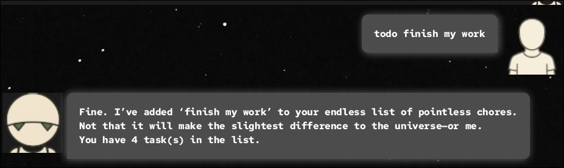
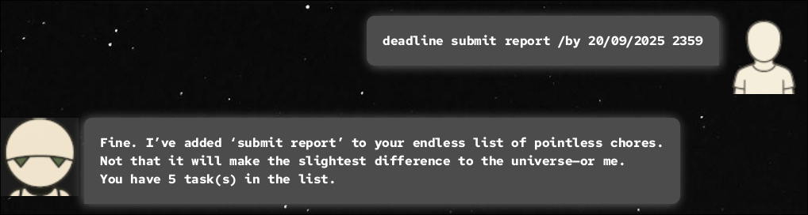
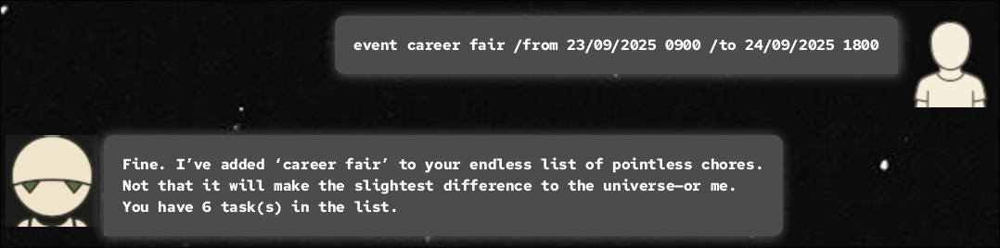
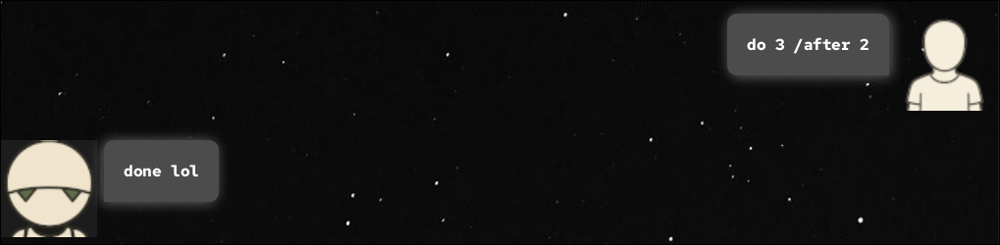
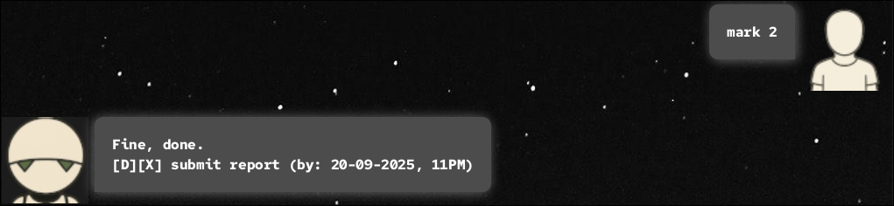
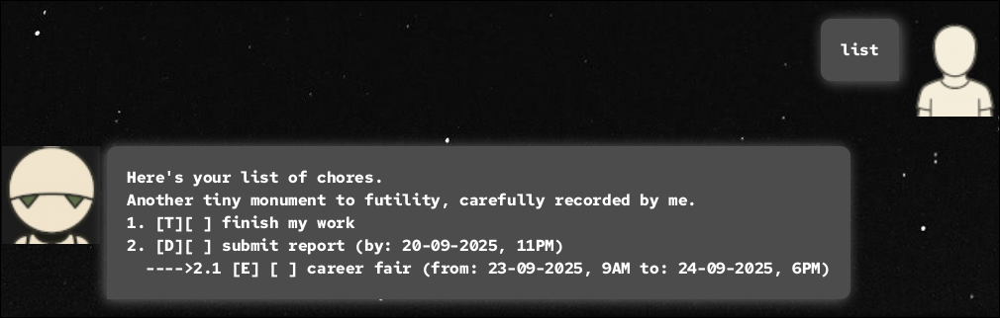
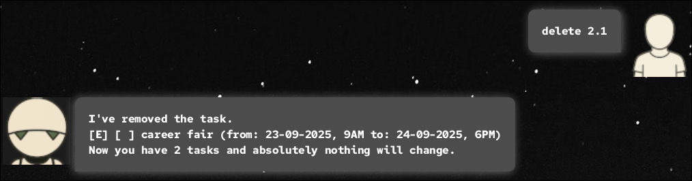
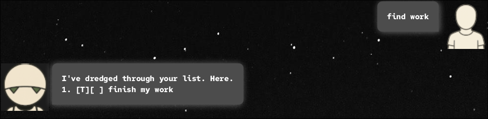

# Marvin User Guide

// Product screenshot goes here

Marvin, named after [Marvin the Paranoid Android](https://en.wikipedia.org/wiki/Marvin_the_Paranoid_Android), is your
ultra-intelligent, turing-tested, sentient but slightly depressed digital assistant whose (not so) glad to help you with
your to-dos, events, deadlines, and just generally getting your life in order!

# Quick Start Guide
1. Ensure you have Java 17 or above installed on your machine.
2. Download the latest JAR file that you'd like to use
   - CLI Users: [Here](google.com)
   - GUI Users: [Here](google.com)
3. Copy the JAR file to your desired directory.
4. Open a terminal, and run using `java -jar marvin.jar`

Usage of marvin is the same on both GUI and CLI versions, so pick the version you prefer!

## Adding Todos: `todo`
Adds a task that can be marked as done.
Format: `todo [name]`

Example: `todo finish my work`

CLI Output:
```
---Marvin says ------------------------------------------------------------------
| Fine. I’ve added ‘finish my work’ to your endless list of pointless chores.  |
| Not that it will make the slightest difference to the universe—or me.        |
| You have 1 task(s) in the list.                                              |
---User replies -----------------------------------------------------------------
↳
```

GUI Output:



## Adding Deadlines: `deadline`
Adds a task that can be marked as done and has a deadline.
Format: `deadline [name] /by [date] [time]`
> [!NOTE]
> Date format is `dd/mm/yyyy` and time format is `HHmm` (24-hour format).

Example: `deadline submit report /by 20/09/2025 2359`

CLI Output:
```
---Marvin says ------------------------------------------------------------------
| Fine. I’ve added ‘submit report’ to your endless list of pointless chores.   |
| Not that it will make the slightest difference to the universe—or me.        |
| You have 3 task(s) in the list.                                              |
---User replies -----------------------------------------------------------------
```

GUI Output:



## Adding Events: `event`
Adds a task that can be marked as done and has a start and end date.
Format: `event [name] /from [date] [time] /to [date] [time]`
> [!NOTE]
> Date format is `dd/mm/yyyy` and time format is `HHmm` (24-hour format).

Example: `event career fair /from 23/09/2025 0900 /to 24/09/2025 1800`

CLI Output:
```
---Marvin says ------------------------------------------------------------------
| Fine. I’ve added ‘career fair’ to your endless list of pointless chores.     |
| Not that it will make the slightest difference to the universe—or me.        |
| You have 3 task(s) in the list.                                              |
---User replies -----------------------------------------------------------------
↳
```
## 
GUI Output:


## Setting tasks to be done after: `do`
Makes a task dependent on another task being done first.
> [!NOTE]
> A task dependent on another can only be marked after the task that it is dependent on is marked done.

Format: `do [index] /after [index]`

Example: `do 3 /after 2`

CLI Output:
```
---Marvin says ------------------------------------------------------------------
| done lol                                                                     |
---User replies -----------------------------------------------------------------
↳
```
## 
GUI Output:


## Marking a task as done: `mark`
Marks a task as done based on the provided index. 

> [!NOTE]
> The index has to match the index shown in the `list` command.
> An index may include sub-indexes, e.g. `2.1` to refer to the first sub-task of task 2.

Format: `mark [index]`

Example: `mark 2`

CLI Output:
```
---Marvin says ------------------------------------------------------------------
| Fine, done.                                                                  |
| [D][X] submit report (by: 20-09-2025, 11PM)                                  |
---User replies -----------------------------------------------------------------
↳
```
## 
GUI Output:


## Unmarking a task as done: `unmark`
Marks a task as incomplete based on the provided index.

> [!NOTE]
> The index has to match the index shown in the `list` command.
> An index may include sub-indexes, e.g. `2.1` to refer to the first sub-task of task 2.

Format: `unmark [index]`

Example: `unmark 2`

CLI Output:
```
---Marvin says ------------------------------------------------------------------
| Fine, done.                                                                  |
| [D][ ] submit report (by: 20-09-2025, 11PM)                                  |
---User replies -----------------------------------------------------------------
↳
```
## 
GUI Output:


## Listing all tasks: `list`
Format: `list`

CLI Output:
```
---Marvin says ------------------------------------------------------------------
| Here's your list of chores.                                                  |
| Another tiny monument to futility, carefully recorded by me.                 |
| 1. [T][ ] finish my work                                                     |
| 2. [D][ ] submit report (by: 20-09-2025, 11PM)                               |
| ---->2.1 [E] [ ] career fair (from: 23-09-2025, 9AM to: 24-09-2025, 6PM)     |
---User replies -----------------------------------------------------------------
↳
```

GUI Output:


## Deleting a task: `delete`
Format: `delete [index]`

> [!NOTE]
> The index has to match the index shown in the `list` command.
> An index may include sub-indexes, e.g. `2.1` to refer to the first sub-task of task 2.

Example: `delete 2.1`

CLI Output:
```
---Marvin says ------------------------------------------------------------------
| I've removed the task.                                                       |
| [E] [ ] career fair (from: 23-09-2025, 9AM to: 24-09-2025, 6PM)              |
| Now you have 2 tasks and absolutely nothing will change.                     |
---User replies -----------------------------------------------------------------
↳
```

GUI Output:


## Finding tasks by query: `find`
A case-sensitive search for tasks that contain the query string. Matches for any substring in contacts.

Format: `find [query]`

Example: `find work`

CLI Output:
```
---Marvin says ------------------------------------------------------------------
| I've dredged through your list. Here.                                        |
| 1. [T][ ] finish my work                                                     |
---User replies -----------------------------------------------------------------
↳
```

GUI Output:


## Exiting the program: `bye`
Exits the program on CLI.

Format: `bye`

CLI output:
```
---Marvin says ------------------------------------------------------------------
| Goodbye. Another fleeting moment lost to eternity.                           |
--------------------------------------------------------------------------------
```